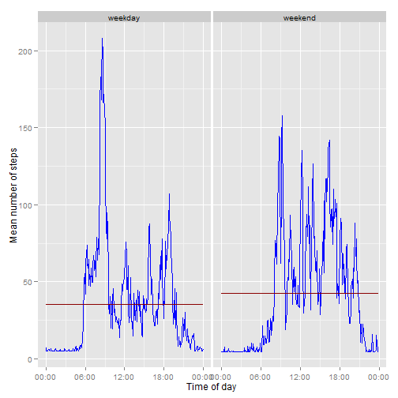

## Reproducible Research: Peer Assessment 1


* * *
### Loading and preprocessing the data

```r
unzip("activity.zip")
activity <- read.csv("activity.csv")
```

Look at the data to get an idea what it contains.


```r
head(activity)
```

```
##   steps       date interval
## 1    NA 2012-10-01        0
## 2    NA 2012-10-01        5
## 3    NA 2012-10-01       10
## 4    NA 2012-10-01       15
## 5    NA 2012-10-01       20
## 6    NA 2012-10-01       25
```


```r
str(activity)
```

```
## 'data.frame':	17568 obs. of  3 variables:
##  $ steps   : int  NA NA NA NA NA NA NA NA NA NA ...
##  $ date    : Factor w/ 61 levels "2012-10-01","2012-10-02",..: 1 1 1 1 1 1 1 1 1 1 ...
##  $ interval: int  0 5 10 15 20 25 30 35 40 45 ...
```


##### First create some helper columns.

For parts of this code I looked [at Stackoverflow](http://bit.ly/1y21Cge) and some [Oracle docs](http://bit.ly/1D7jZQS) 

Add a datetime column that combines the date and interval from the original set.


```r
time <- formatC(activity$interval/100, 2, format = "f")
activity$datetime <- as.POSIXct(paste(activity$date, time), format = "%Y-%m-%d %H.%M", tz = "GMT")
```

Quick check if this is a valid column

```r
head(activity$datetime)
```

```
## [1] "2012-10-01 00:00:00 GMT" "2012-10-01 00:05:00 GMT"
## [3] "2012-10-01 00:10:00 GMT" "2012-10-01 00:15:00 GMT"
## [5] "2012-10-01 00:20:00 GMT" "2012-10-01 00:25:00 GMT"
```

Add time column uses a single date for all times in the set, default for the date because we look only at the time part of this column in the analysis. 


```r
activity$time <- format(activity$datetime, format = "%H:%M:%S")
activity$time <- as.POSIXct(activity$time, format = "%H:%M:%S")
```

Quick check if this is a valid column

```r
head(activity$time)
```

```
## [1] "2014-09-14 00:00:00 CEST" "2014-09-14 00:05:00 CEST"
## [3] "2014-09-14 00:10:00 CEST" "2014-09-14 00:15:00 CEST"
## [5] "2014-09-14 00:20:00 CEST" "2014-09-14 00:25:00 CEST"
```

The dataset is ready for analysis.


* * *
### What is the mean total number of steps taken per day?

Create a vector with total number of steps for each day, using tapply set to remove any NA's.


```r
tot.steps <- tapply(activity$steps, activity$date, sum, na.rm = TRUE)
```

1. The distribution of total number of steps per day in a histogram:


```r
library(ggplot2)
qplot(tot.steps, xlab = "Total steps excluding NA's", ylab = "Frequency")
```

```
## stat_bin: binwidth defaulted to range/30. Use 'binwidth = x' to adjust this.
```

 

2a. The mean for the total steps per day:


```r
mean(tot.steps)
```

```
## [1] 9354
```

2b. The median for the total steps per day:


```r
median(tot.steps)
```

```
## [1] 10395
```


* * *
## What is the average daily activity pattern?

Calculate for each five minute interval the mean of the steps and put it in a data frame, again we exclude any NA's.


```r
steps.mean <- tapply(activity$steps, activity$time, mean, na.rm = TRUE)
daily.pattern <- data.frame(time = as.POSIXct(names(steps.mean)), steps.mean = steps.mean)
```


1. Plot a time series for the mean of steps.


```r
library(scales)
ggplot(daily.pattern, aes(time, steps.mean)) + geom_line() + xlab("Time of day") + 
    ylab("Steps mean excluding NA's") + scale_x_datetime(labels = date_format(format = "%H:%M"))
```

 


2. Which five minute interval has the highest mean number of steps?


```r
max.steps <- which.max(daily.pattern$steps.mean)
format(daily.pattern[max.steps, "time"], format = "%H:%M")
```

```
## [1] "08:35"
```

* * *
### Imputing missing values

Peek into our dataset and determine intervals with missing step counts ("NA's"):


```r
summary(activity$steps)
```

```
##    Min. 1st Qu.  Median    Mean 3rd Qu.    Max.    NA's 
##     0.0     0.0     0.0    37.4    12.0   806.0    2304
```


Use the steps mean for a five-minute interval to fill in NA's for that particular interval in the dataset.


```r
library(Hmisc)
```

```
## Loading required package: grid
## Loading required package: lattice
## Loading required package: survival
## Loading required package: splines
## Loading required package: Formula
## 
## Attaching package: 'Hmisc'
## 
## The following objects are masked from 'package:base':
## 
##     format.pval, round.POSIXt, trunc.POSIXt, units
```

```r
activity.na.filled <- activity
activity.na.filled$steps <- with(activity.na.filled, impute(steps, mean))
```


Let's compare the mean and median steps for each day between the original data set and the imputed data set.


```r
total.steps.na.filled <- tapply(activity.na.filled$steps, activity.na.filled$date, sum)
mean(tot.steps)
```

```
## [1] 9354
```


```r
mean(total.steps.na.filled)
```

```
## [1] 10766
```


```r
median(tot.steps)
```

```
## [1] 10395
```


```r
median(total.steps.na.filled)
```

```
## [1] 10766
```


A histogram of the imputed dataset.


```r
qplot(total.steps.na.filled, xlab = "Total steps", ylab = "Frequency")
```

```
## stat_bin: binwidth defaulted to range/30. Use 'binwidth = x' to adjust this.
```

 

Imputing the missing data has increased the average number of steps.

* * *
### Are there differences in activity patterns between weekdays and weekends?

Add a factor column for whether a day is a weekday or weekend.


```r
weekday <- function(date) {
    if (weekdays(date) %in% c("Saturday", "Sunday")) {
        return("weekend")
    } else {
        return("weekday")
    }
}

days <- sapply(activity.na.filled$datetime, weekday)
activity.na.filled$weekday <- as.factor(days)
```
  
Now create a dataframe for the mean of steps for both weekdays and weekends.


```r
steps.mean <- tapply(activity.na.filled$steps, interaction(activity.na.filled$time, 
    activity.na.filled$weekday), mean, na.rm = TRUE)
weekday.pattern <- data.frame(time = as.POSIXct(names(steps.mean)), steps.mean = steps.mean, 
    weekday = as.factor(c(rep("weekday", 288), rep("weekend", 288))))
```
  
  
To compare activity patterns between weekdays and weekends we use a panel plot. The blue line depicts the mean number of steps over each 24 hour period. First on weekdays, next on weekends. The darkred horizontal line is the average of the mean of steps, I used the sample here at [Stackoverflow](http://bit.ly/1s29V8X)

The differences between weekdays and weekends are as follows;  
  
* The variability in the mean of step activity on weekdays is larger. 
* The average number of steps in total is slightly higher over weekends.

This would be interesting to research further, it could mean our feet are working harder over the weekend. Of course it also depends on weekday activity, do people who work outside all week have lower activity over the weekend compared to people who sit in an office during weekdays?


```r
ggplot(weekday.pattern, aes(time, steps.mean)) + geom_line(colour="blue") + xlab("Time of day") + 
    ylab("Mean number of steps") + scale_x_datetime(labels = date_format(format = "%H:%M")) + 
    facet_grid(. ~ weekday) + geom_line(stat = "hline", yintercept = "mean", colour="darkred")
```

 
